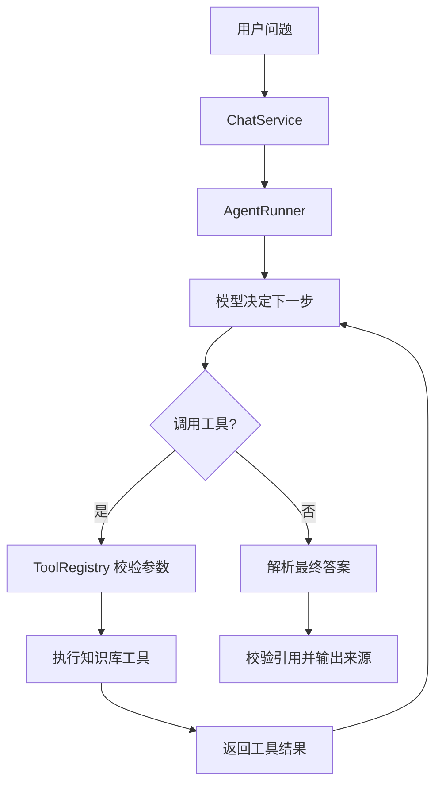

# Learning AI Agent

用于学习和实践 AI Agent、RAG、Tool Calling、MCP 与 AI Coding 的项目仓库。

## 当前项目

`studymate/` 是一个运行在 CMD 中的本地学习知识库助手：

- 递归读取 Markdown/TXT 知识库。
- 使用本地检索获取相关资料。
- 调用 OpenAI-compatible 模型生成带来源的回答。
- 支持 Claude Code、OpenCode、Codex 官方文档更新。
- 第一阶段已经加入最小 Agent Runtime。
- Agent 可以自主调用 `search_knowledge` 和 `open_document` 两个只读工具。

## 运行

```powershell
cd studymate
py -m pip install -e ".[dev]"
py -m studymate chat --knowledge .\knowledge
```

首次运行前复制 `.env.example` 为 `.env`，填写模型服务配置和 API Key。`.env` 不会提交到 GitHub。

## 第一阶段 Agent 流程



Agent 的核心实现位于：

- `studymate/src/studymate/agent.py`
- `studymate/src/studymate/tool_registry.py`
- `studymate/src/studymate/tools.py`
- `studymate/src/studymate/llm.py`

详细设计：

- `studymate/docs/07-agent-scope.md`
- `studymate/docs/08-tool-contracts.md`
- `studymate/docs/09-agent-loop.md`
- `studymate/docs/03-architecture.md`

## 知识库

知识库位于 `studymate/knowledge/`，支持继续创建子目录：

```text
studymate/knowledge/
  ai-agent/
  claude-code/
  opencode/
  codex/
```

更新配置中的在线文档：

```powershell
cd studymate
py -m studymate update-docs --proxy 127.0.0.1:7897
```

## 测试

```powershell
cd studymate
py -m pytest
```

Agent 第一阶段测试覆盖工具注册、参数校验、路径安全、连续工具调用、工具错误和最大执行步数。

## 学习记录

知识问答和项目决策记录位于 [studymate/docs/learning-log/](studymate/docs/learning-log/)。

- [2026-08-09 Agent 基础与 StudyMate 第一阶段](studymate/docs/learning-log/2026-08-09-agent-foundations.md)
