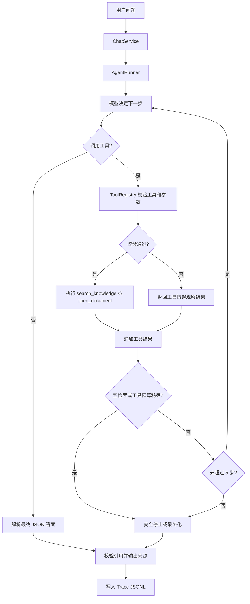

# StudyMate

StudyMate 是一个运行在命令行中的本地知识库学习 Agent，也是一个用于理解 RAG、Tool Calling、Agent Runtime、Trace 和 Eval 的工程化练习项目。

它读取本地 Markdown / TXT 学习资料，让模型自行决定是否调用受限工具检索或打开文档，再生成带来源的回答、学习建议或下一步问题。项目不追求通用聊天能力，而是优先保证工具边界、引用来源、停止条件和可观察性。

## 项目定位

当前实现的是一个最小、可验证的 Agent Runtime：

- 面向个人学习资料，不读取知识库之外的文件，也不执行 Shell 或修改文件。
- 只开放 `search_knowledge` 和 `open_document` 两个只读工具。
- 通过工具预算、空检索和最大步数防止模型循环消耗 Token。
- 通过引用校验阻止模型捏造来源。
- 通过 `/trace` 和 JSONL 会话文件记录一次任务如何执行；Trace 不会回传给模型。

它适合作为下一步学习 Agent Eval、查询规范化、混合检索、MCP 和 AI Coding Agent 的基础，而不是作为生产知识库产品直接使用。

## 当前架构

```text
用户问题
  -> ChatService：命令、短期对话历史、最终展示
  -> AgentRunner：步骤上限、工具预算、停止条件、Trace
  -> OpenAIAnswerer：OpenAI-compatible 模型和流式 Tool Calling 适配
  -> ToolRegistry：Schema 校验和受控工具执行
       -> search_knowledge / open_document
            -> SearchIndex：可替换的检索接口
                 -> InMemorySearchIndex / SQLiteFTS5SearchIndex：词法检索 + BM25 排序
  -> 引用校验 + Answer
  -> TraceStore：问题、回答、执行摘要追加到 JSONL
```

`Agent Loop` 是其中“模型决定 -> 工具执行 -> 观察结果 -> 再决定”的循环；`Agent Runtime` 则是上面整套模型适配、工具、状态、限制、Trace 和错误处理机制。

## 1. 知识库放在哪里

默认知识库路径是：

~~~text
D:\develop_projects\Learning-AI-Agent\studymate\knowledge\
~~~

你可以直接把 Markdown 文件放在这里，也可以继续创建子文件夹。

StudyMate 会递归扫描所有子文件夹，所以以下结构都可以：

~~~text
studymate/
  knowledge/
    claude-code/
      overview.md
      commands.md
      workflows.md
    opencode/
      overview.md
      configuration.md
    codex/
      overview.md
      prompts.md
    ai-agent/
      rag.md
      tool-calling.md
      evaluation.md
  traces/                 # 自动生成的问答与 Agent Trace，默认不提交 Git
~~~

支持的文件扩展名：

- .md
- .markdown
- .txt

推荐按主题建立文件夹，例如：

- knowledge/claude-code/
- knowledge/opencode/
- knowledge/codex/
- knowledge/ai-agent/
- knowledge/python/
- knowledge/backend/

文件夹不会影响检索。目录和文件名会作为来源路径显示在回答中，例如：

~~~text
Sources:
- claude-code/commands.md:12-28
~~~

## 2. 文档建议

每个 Markdown 文件建议：

- 只讲一个主题。
- 使用清晰的一级和二级标题。
- 每个知识点尽量配一个例子。
- 不要把几十个完全无关的主题合并到一个文件。
- 保留官方文档的版本、更新时间和来源说明。

例如：

~~~markdown
# Claude Code Commands

来源版本：2026-08

## /init

功能说明……

## /plan

功能说明……
~~~

## 3. 安装和运行

在 studymate 目录执行：

~~~powershell
cd D:\develop_projects\Learning-AI-Agent\studymate
py -m pip install -e ".[dev]"
~~~

扫描知识库：

~~~powershell
py -m studymate ingest .\knowledge
~~~

启动对话：

~~~powershell
py -m studymate chat --knowledge .\knowledge
~~~

每次 Agent 问答会追加到一个 JSONL 会话文件。默认目录是 `traces/`；也可以指定其他路径：

~~~powershell
py -m studymate chat --trace-dir .\my-traces
~~~

对话中输入 `/trace` 可查看上一轮的工具调用、工具结果摘要、停止原因和耗时。Trace 不会作为上下文再次发送给模型。

### 3.1 运行 Agent Evaluation

`Trace` 记录 Agent 做了什么，`Evaluation` 判断这次执行是否符合预期。Evaluation 不参与当前任务的循环控制；AgentRunner 先根据工具预算、空检索和最大步数结束任务，Evaluation 再检查停止原因、工具调用、检索来源、引用、关键词和拒答行为。

默认评测数据位于 `tests/eval/questions.jsonl`，每行一个 JSON 对象。评测报告会写入 `evals/latest.json`，并且不会提交 Git：

~~~powershell
py -m studymate eval --knowledge .\\knowledge `
  --dataset .\\tests\\eval\\questions.jsonl `
  --output .\\evals\\latest.json
~~~

检索指标默认使用 `K=5`，也可以显式调整：

~~~powershell
py -m studymate eval --retrieval-k 5
~~~

评测数据支持以下字段：

- `id`、`input`：测试用例标识和用户问题。
- `intent`：可选的 `question`、`goal` 或 `keyword`，会作为 Agent 输入前缀。
- `expected_sources`：期望检索和引用的文档路径；空列表表示期望没有来源。
- `required_terms`：最终回答中必须出现的关键词。
- `expected_tools`：期望按顺序调用的工具。
- `expected_stop_reason`：例如 `final_answer`、`empty_search` 或 `max_steps`。
- `should_abstain`：是否应该声明知识库证据不足。

评测报告的 `summary.metrics` 还会统计：

- `retrieval.hit_at_k`、`recall_at_k`、`precision_at_k`、`mrr`：检索命中、召回、精确率和首个相关来源排名。
- `citation.accuracy`、`citation.coverage`：引用是否来自期望来源，以及期望来源被引用的覆盖率。
- `abstention.rate`、`abstention.accuracy`：实际拒答比例，以及标记了 `should_abstain` 的用例预测是否正确。
- `latency.average_ms`：完成 Agent 用例的平均耗时。

Recall、MRR 和 Citation Coverage 只在 `expected_sources` 非空的正向用例上汇总；Hit、Precision、Citation Accuracy 和拒答率包含无来源用例。无来源用例在没有误召回、没有引用时视为正确。

命令返回码为：全部用例通过返回 `0`，任意用例失败返回 `1`。每个用例的报告包含 `loop_completed`，因此可以直接发现 Agent 是否因为 `max_steps` 异常结束；这只是评测结果，不会在运行中替代 AgentRunner 的停止条件。

## 4. 自动更新在线开发文档

文档源配置位于：

~~~text
config/docs_sources.json
~~~

当前默认启用三个官方文档源：

- `claude-code`：Anthropic Claude Code 官方文档。
- `opencode`：OpenCode 官方文档。
- `codex`：OpenAI Codex 官方仓库中的 README 和开发文档。

更新所有已启用的文档：

~~~powershell
py -m studymate update-docs --proxy 127.0.0.1:7897 --workers 8
~~~

也可以直接运行独立脚本：

~~~powershell
py .\scripts\update_docs.py --proxy 127.0.0.1:7897
~~~

如果已经配置 `STUDYMATE_DOCS_PROXY`，可以省略 `--proxy`。`--workers` 控制并发下载数，默认是 8。只更新指定项目：

~~~powershell
py -m studymate update-docs --only claude-code opencode
~~~

在对话中输入 `/update` 会更新配置中启用的项目，并自动重载检索索引；输入 `/update codex` 只更新 Codex。配置中的 `enabled` 可以控制默认更新哪些项目。

下载文件会写入 `knowledge/<source-id>/`，并按配置中的分类规则保存为 Markdown。文档更新器只覆盖它生成的同名文件，不会删除目录中的其他学习资料。

如果当前目录已经是 studymate，也可以直接使用默认路径：

~~~powershell
py -m studymate chat
~~~

## 5. 环境变量

设置模型服务。推荐使用通用 Provider 配置：

~~~text
STUDYMATE_TYPE=openai_compatible
STUDYMATE_PROVIDER=newapi
STUDYMATE_ENDPOINT_TYPE=openai
STUDYMATE_API_KEY=
STUDYMATE_BASE_URL=https://huazi.de5.net/v1
STUDYMATE_MODEL=claude-sonnet-4-5-20250929
~~~

其中：

- `STUDYMATE_TYPE` 当前必须是 `openai_compatible`。
- `STUDYMATE_PROVIDER` 用于标识供应商，例如 `newapi`、`deepseek`。
- `STUDYMATE_ENDPOINT_TYPE` 当前必须是 `openai`。
- `STUDYMATE_API_KEY` 是模型服务密钥。
- `STUDYMATE_BASE_URL` 是 OpenAI 兼容接口根地址。
- `STUDYMATE_MODEL` 是供应商支持的模型名称。
- `STUDYMATE_MAX_TOKENS` 是单次 Agent 模型请求允许生成的最大 Token 数，默认 `4096`。
- 对 `provider=newapi`，如果 Base URL 没有路径，程序会自动补充 `/v1`。
- `STUDYMATE_DEBUG=true` 会输出脱敏的请求诊断信息，排查完成后建议改为 `false`。
- `STUDYMATE_RESPONSE_FORMAT` 可设为 `json_object` 或 `none`。NewAPI/Claude 兼容接口默认建议使用 `none`，避免上游拦截该参数；程序仍会通过 Prompt 要求模型返回 JSON。
- `STUDYMATE_STREAM` 控制流式响应。留空时，NewAPI 自动启用流式模式，其他兼容接口默认关闭；若使用 NewAPI/Claude，建议保持留空或显式设为 `true`。Agent 会在内部聚合完整响应后再显示答案。
- `STUDYMATE_USER_AGENT` 用于覆盖 HTTP 客户端 User-Agent。默认是 `ai-sdk/openai-compatible/2.0.37`，用于兼容会拦截 `OpenAI/Python` 的网关（例如当前 Huazi Cloudflare 配置）。
- `STUDYMATE_HTTP_REFERER`、`STUDYMATE_X_TITLE` 和 `STUDYMATE_EXTRA_HEADERS_JSON` 用于传递供应商要求的额外请求头。
- STUDYMATE_DOCS_PROXY 是在线文档更新使用的 HTTP 代理，例如 `http://127.0.0.1:7897`。

原有 `OPENAI_*` 变量仍然兼容。如果 `STUDYMATE_*` 对应字段为空，程序会回退读取：

~~~text
OPENAI_API_KEY=
OPENAI_BASE_URL=
OPENAI_MODEL=
~~~

DeepSeek 配置示例：

~~~text
STUDYMATE_PROVIDER=deepseek
STUDYMATE_BASE_URL=https://api.deepseek.com
STUDYMATE_MODEL=deepseek-chat
STUDYMATE_API_KEY=填写你的 DeepSeek API Key
~~~

当前实现适配的是 OpenAI 兼容的 `/chat/completions` 接口；不符合 OpenAI 协议的供应商，需要另外实现 Provider Adapter。

如果 DeepSeek 返回 `HTTP 402 Insufficient Balance`，说明 API 请求已经到达服务端，但账户余额不足，需要在 DeepSeek 开放平台充值或更换有余额的 API Key。

不要把 API Key 或 .env 提交到 Git。

## 6. 当前功能

当前版本已经实现：

- 递归读取 Markdown / TXT 知识库。
- 文档标题识别。
- 文档切分。
- 可替换的 `SearchIndex` 检索接口。
- 本地 BM25 风格检索，支持中英文领域词扩展、查询归一化、英文停用词、短语匹配以及标题/路径加权排序。
- SQLite FTS5 / BM25 检索后端，可通过 CLI 参数切换。
- CLI 对话服务。
- 问题、学习目标、关键词输入分类。
- 回答来源校验。
- /help、/sources、/trace、/reset、/quit 命令。
- OpenAI 兼容模型调用适配。
- 自动更新 Claude Code、OpenCode、Codex 官方 Markdown 文档。
- 第一阶段最小 Agent Runtime。
- 原生 Tool Calling 和工具结果回传。
- `search_knowledge`、`open_document` 两个只读工具。
- Agent Trace、`/trace` 和按会话 JSONL 问答记录。
- Agent Evaluation、JSONL 评测数据和 JSON 汇总报告。

当前默认搜索基线是 `InMemorySearchIndex`，通过 `SearchIndex` 接口向 Agent 工具提供检索能力。它使用无额外依赖的 BM25 风格评分，并加入中英文领域词扩展、`agentloop`/CamelCase/连字符归一化、查询停用词过滤、短语匹配以及标题/路径加权。

另一个可选后端是 `SQLiteFTS5SearchIndex`：它把每个 `Chunk` 的路径、标题和正文写入 SQLite FTS5 虚拟表，使用 SQLite 内置 `bm25()` 排序，再转换回相同的 `SearchResult`。它仍然是关键词/词法检索，不是 Embedding 语义检索。两个后端的分数绝对值不需要相同，应该用评测集中的 Hit@K、Recall@K、Precision@K 和 MRR 比较召回质量。

默认运行内存后端：

```powershell
py -m studymate chat --knowledge .\knowledge
```

切换到 SQLite FTS5 / BM25：

```powershell
py -m studymate chat `
  --knowledge .\knowledge `
  --search-backend sqlite `
  --search-db .\data\studymate-search.sqlite3
```

评测时也可以切换后端：

```powershell
py -m studymate eval `
  --knowledge .\knowledge `
  --search-backend sqlite `
  --search-db .\data\studymate-search.sqlite3
```

SQLite 数据库在启动时根据当前知识库的 `Chunk` 重建，因此执行 `/update` 后，当前会话会自动重新切分并重建索引。`data/` 下的数据库文件是本地生成物，不包含 API Key，建议不要提交到 Git。

### 检索结果对比

使用 `compare-search` 可以同时查看内存 BM25 风格检索和 SQLite FTS5/BM25 的结果：

```powershell
py -m studymate compare-search `
  --knowledge .\knowledge `
  --query "agent loop 和 agent runtime 有什么区别？" `
  --query "What is MCP?" `
  --output .\logs\search-comparison.jsonl
```

命令会在 CMD 打印每个后端的排名、分数、路径、行号和命中词，并将同样的信息写入 JSONL。这个日志用于比较检索行为，不是 Agent 的 Trace，也不会发送给模型。Embedding 和 LLM Reranker 代码暂时保留在源码中用于学习，但不属于当前 StudyMate 主流程。

## 7. 当前问答实现

StudyMate 的 CLI 当前采用：

~~~text
用户问题
  -> AgentRunner
  -> 模型决定是否调用可用工具
  -> ToolRegistry 校验并执行工具
  -> 工具结果作为观察消息返回模型
  -> 模型继续调用工具或进入最终化
  -> 校验引用并显示答案
  -> 追加问题、回答和执行摘要到 Trace JSONL
~~~

### 7.1 是否流式

普通 RAG 和 Agent 都可使用流式请求。`STUDYMATE_STREAM` 留空时，NewAPI 默认开启流式，其他 Provider 默认关闭；NewAPI/Claude 建议显式设为 `true`。Agent 在本地聚合完整的工具调用增量和最终 JSON 后，CMD 再一次性打印答案，因此当前不是逐 Token 展示。

对应代码：

- `src/studymate/llm.py`：构造 Prompt、调用模型、解析 JSON。
- `src/studymate/cli.py`：读取完整回答后打印到 CMD。

如果模型网关返回 `HTTP 403 Your request was blocked`，先检查 debug 日志中的 `user_agent`。当前 Huazi 的 Cloudflare 会拦截 `OpenAI/Python`，而 AI SDK 风格的 User-Agent 可以通过。该问题发生在模型鉴权之前，不代表 Key 或模型权限错误。

### 7.2 是否有历史记录

当前有“当前进程内的短期历史”，也有独立的本地执行记录：

- 每次问答会保存用户问题和模型回答。
- 默认最多保留 10 条消息。
- 实际发送给模型时使用最近 6 条消息，约 3 轮对话。
- `/reset` 会清空内存中的对话历史，不会删除已落盘的 Trace。
- 退出程序或重新启动后，对话历史会丢失，且不会从 Trace 自动恢复。
- 每次 Agent 问答会追加到 `traces/session-<id>.jsonl`。其中包含问题、最终回答、来源和工具执行摘要，但不含 API Key、HTTP 请求头或完整知识库正文；`traces/` 已被 Git 忽略。

因此，Trace 是开发排查与复盘记录，不是 Memory，也不会影响下一轮模型回答。

对应代码：`src/studymate/chat.py`、`src/studymate/trace.py`、`src/studymate/llm.py`。

### 7.3 检索和模型的边界

Agent 不再由 `ChatService` 固定执行检索，而是把 `search_knowledge` 暴露给模型，由模型根据问题自主决定是否检索。历史会发送给模型帮助理解“它”“上一个问题”等指代，但当前不会使用历史改写检索问题。

`search_knowledge` 没有返回证据时，`AgentRunner` 会以 `empty_search` 停止本轮任务，直接返回“知识库资料不足”，不会继续请求模型。检索到证据后，模型只能基于传入片段生成回答。

模型返回的引用还会经过校验。如果引用不属于本次检索结果，回答会被拦截，避免产生无法追溯的来源。

### 7.4 当前能力边界

| 能力 | 当前状态 |
| --- | --- |
| 本地 Markdown/TXT 检索 | 已实现 |
| SearchIndex 可替换检索接口 | 已实现；由 `build_search_index()` 统一构造，支持 InMemorySearchIndex 和 SQLiteFTS5SearchIndex |
| BM25 风格本地排序 | 已实现；包含词频、逆文档频率和文档长度归一化 |
| SQLite FTS5 / BM25 检索 | 已实现；通过 `--search-backend sqlite` 选择，保留统一 Chunk 和 SearchResult |
| AI 模型生成回答 | 已实现；普通路径与 Agent 路径均可使用流式 |
| Agent 工具调用循环 | 已实现，最多 5 步；每个只读工具默认每轮任务仅可成功调用一次，重复调用后强制进入最终化 |
| Agent 工具注册和参数校验 | 已实现 |
| 当前会话短期历史 | 已实现，仅内存保存 |
| Agent Trace 和问答落盘 | 已实现，按进程写入 `traces/session-*.jsonl`，不参与模型上下文 |
| Agent Evaluation | 已实现，检查停止原因、工具、检索、引用、关键词和拒答行为，并输出检索质量指标 |
| 跨进程恢复会话历史 | 尚未实现 |
| 基于历史改写检索 | 尚未实现 |
| Embedding/向量检索 | 暂不启用；源码保留为后续学习实验 |
| Reranker | 暂不启用；当前只验证本地词法检索排序 |
| 流式请求 | 已实现；当前 CMD 聚合完整 JSON 后一次性显示 |

## 8. 代码更新记录

以下记录用于追踪功能、代码位置和验证方式。后续新增功能时，继续在本节追加记录。

| 日期 | 功能 | 主要代码位置 | 更新内容和验证 |
| --- | --- | --- | --- |
| 2026-08-02 | RAG 基础问答 | `src/studymate/ingest.py`、`src/studymate/search.py`、`src/studymate/chat.py` | 递归读取知识库、切分文档、本地关键词检索、拼接证据后调用模型。 |
| 2026-08-02 | 非流式模型调用 | `src/studymate/llm.py`、`src/studymate/cli.py` | 使用 OpenAI 兼容 Chat Completions，一次性返回结构化 JSON。 |
| 2026-08-02 | 短期对话历史 | `src/studymate/chat.py`、`src/studymate/llm.py` | 保存当前进程内最近消息；支持 `/reset`，不做持久化。 |
| 2026-08-02 | 引用安全校验 | `src/studymate/citations.py`、`src/studymate/models.py` | 校验模型引用是否来自实际检索片段。 |
| 2026-08-02 | 在线文档更新 | `config/docs_sources.json`、`src/studymate/docs_updater.py`、`scripts/update_docs.py` | 支持 Claude Code、OpenCode、Codex 配置化更新，并写入 `knowledge/<source-id>/`。 |
| 2026-08-02 | CMD 更新命令 | `src/studymate/input.py`、`src/studymate/chat.py`、`src/studymate/cli.py` | 支持 `update-docs`、`/update`、`/update codex`，更新后自动重载检索索引。 |
| 2026-08-02 | 测试和开发依赖 | `tests/`、`pyproject.toml` | 已安装 pytest，当前测试结果为 `25 passed`。 |
| 2026-08-02 | 模型服务错误处理 | `.env`、`src/studymate/llm.py`、`src/studymate/chat.py`、`tests/integration/test_query_workflow.py` | 支持 DeepSeek/OpenAI 兼容接口；将 402 余额不足、鉴权失败和限流错误转换为可读提示，并显示当前接口和模型，避免会话崩溃；测试结果为 `26 passed`。 |
| 2026-08-02 | 通用 Provider 配置 | `.env`、`.env.example`、`src/studymate/llm.py`、`tests/contract/test_llm_contract.py` | 增加 `type/provider/endpointType/apiKey/baseUrl/model` 对应配置；兼容 NewAPI 的 `/v1` 地址和不同 OpenAI 兼容模型；测试结果为 `27 passed`。 |
| 2026-08-02 | API 请求诊断 | `src/studymate/llm.py`、`.env`、`.env.example` | 增加 `STUDYMATE_DEBUG`；输出最终请求 URL、Key 来源/长度、模型和脱敏服务端错误，辅助定位 401/403/402。 |
| 2026-08-02 | NewAPI 请求兼容 | `src/studymate/llm.py`、`.env`、`tests/contract/test_llm_contract.py` | NewAPI 默认不发送 `response_format`，兼容 Claude 上游；增加代码块 JSON 解析；测试结果为 `28 passed`。 |
| 2026-08-02 | Cherry Studio / Huazi 请求兼容 | `src/studymate/llm.py`、`.env`、`.env.example`、`tests/contract/test_llm_contract.py` | 对齐 Cherry Studio 的 `/v1`、额外 headers、流式请求和 `ai-sdk/openai-compatible/2.0.37` User-Agent；定位并修复 Huazi Cloudflare 拦截 `OpenAI/Python` 导致的 403；测试结果为 `29 passed`（另有 3 个受本机 pytest 临时目录权限影响的用例未执行）。 |
| 2026-08-02 | Claude 引用格式兼容 | `src/studymate/llm.py`、`tests/contract/test_llm_contract.py` | 将模型返回的已检索 `chunk_id` 字符串补全为可审计引用对象；非法响应转换为可读错误，不再导致 CLI 堆栈退出；真实 CMD 问答验证通过。 |
| 2026-08-07 | 第一阶段最小 Agent | `src/studymate/agent.py`、`src/studymate/tool_registry.py`、`src/studymate/tools.py`、`src/studymate/llm.py` | 增加有步数上限的 Agent Loop、原生 Tool Calling、知识库搜索和安全文档读取工具；新增 Agent 和工具 TDD 用例。 |
| 2026-08-09 | NewAPI/Claude Agent 流式兼容 | `src/studymate/llm.py`、`src/studymate/agent.py`、`.env.example`、`tests/contract/test_llm_contract.py` | 聚合流式 `tool_calls` 增量，兼容内容块格式和 `confidence: "high"` 等常见模型输出；NewAPI 留空时自动启用流式。以 Huazi/Claude 真实问答验证工具调用和最终回答均成功；全量测试 `46 passed`。 |
| 2026-08-09 | Agent 工具预算与最终化 | `src/studymate/agent.py`、`src/studymate/llm.py`、`tests/unit/test_agent.py`、`tests/contract/test_llm_contract.py` | 每个工具默认只允许调用一次；重复调用会切换到无工具最终化。为兼容 Bedrock，上述最终化会将工具结果转为普通上下文后再请求模型，避免 `TOOL_CONFIG_MISSING`；以 Huazi/Claude 真实问答验证不会再循环至步骤上限。 |
| 2026-08-09 | Claude 最终 JSON 兼容 | `src/studymate/llm.py`、`tests/contract/test_llm_contract.py` | 响应解析器兼容 `confidence: "high"` 和 `next_steps: "单条建议"` 等常见变体，统一为内部 `Answer` 类型要求的数值和字符串列表。 |
| 2026-08-09 | Agent Trace 与问答落盘 | `src/studymate/trace.py`、`src/studymate/agent.py`、`src/studymate/chat.py`、`src/studymate/cli.py`、`tests/unit/test_trace.py` | 每轮记录工具可用性、调用、结果摘要、停止原因和耗时；问题与回答追加到按会话分组的 JSONL。新增 `/trace` 查看上一轮，不将 Trace 传回模型。 |
| 2026-08-16 | 可引用的文档读取证据 | `src/studymate/tools.py`、`tests/unit/test_tools.py` | `open_document` 为读取的行范围生成稳定 `chunk_id` 并回传证据，使打开的文档也能参与引用校验和 Evaluation。 |
| 2026-08-16 | 中英文混合检索优化 | `src/studymate/search.py`、`tests/unit/test_search.py` | 增加领域词查询扩展、中文停用词过滤、匹配覆盖率以及标题/路径加权；修复 MCP 和“自定义工具”评测用例的召回问题。 |
| 2026-08-16 | Agent Evaluation | `src/studymate/evaluation.py`、`src/studymate/cli.py`、`tests/eval/` | 增加 JSONL 评测数据加载、Agent 隔离执行、停止原因/循环完成、工具成功、检索来源、引用、关键词和拒答检查；增加 `eval` 命令和 `evals/latest.json` 报告。 |
| 2026-08-17 | 可替换检索接口与 BM25 风格基线 | `src/studymate/search.py`、`src/studymate/tools.py`、`src/studymate/chat.py`、`tests/unit/test_search.py`、`docs/adr/ADR-001-search-strategy.md` | 增加 `SearchIndex` Protocol；强化查询归一化、停用词过滤、短语匹配、BM25 风格排序和 Chunk 去重。搜索单元测试覆盖接口替换、`agentloop`/CamelCase/连字符变体和中英文查询。 |
| 2026-08-17 | 检索质量指标 | `src/studymate/evaluation.py`、`src/studymate/cli.py`、`docs/06-evaluation.md` | 增加 `Hit@K`、`Recall@K`、`Precision@K`、`MRR`、Citation Accuracy/Coverage、Abstention Rate/Accuracy 和平均延迟；报告 schema 升级为 2，支持 `--retrieval-k`。 |
| 2026-08-17 | SQLite FTS5 / BM25 后端 | `src/studymate/search.py`、`src/studymate/cli.py`、`docs/adr/ADR-001-search-strategy.md` | 增加 `SQLiteFTS5SearchIndex`；按 Chunk 建立 FTS5 索引，使用 SQLite `bm25()` 排序，并通过 `--search-backend` 在内存和 SQLite 后端之间切换。 |
| 2026-08-18 | 检索范围收敛 | `src/studymate/cli.py`、`src/studymate/comparison.py`、`.env.example` | 主流程关闭 Embedding 和 LLM Reranker，只保留内存 BM25 风格检索与 SQLite FTS5/BM25；相关源码保留为学习实验，避免意外 API 成本。 |

当前待办方向：使用 `compare-search` 和评测集验证内存 BM25 与 SQLite FTS5/BM25 的实际排名；之后再学习 Chunk 参数、混合检索、跨进程记忆和 MCP。

## 9. 开发流程

1. 先阅读 docs/ 中的需求和接口契约。
2. 先运行测试，确认当前失败点。
3. 只实现让当前测试通过的最小代码。
4. 补充边界测试。
5. 更新 README、评估数据和 ADR。

测试命令：

~~~powershell
py -m pytest
~~~

## 10. 第一阶段最小 Agent

StudyMate 当前已经从固定 RAG Workflow 增量升级为一个最小 Agent。它不是通用 Agent 框架，而是面向本地知识库学习场景的 Agent Runtime。

第一阶段只开放两个只读工具：

- `search_knowledge`：检索本地知识库，返回片段和来源。
- `open_document`：打开知识库内的指定文档或行范围。

Agent 会根据用户问题自主决定是否调用工具。工具执行由 `ToolRegistry` 完成，模型不能直接执行 Python、Shell 或文件系统操作。

### 10.1 Agent 运行流程



### 10.2 代码位置

- `src/studymate/agent.py`：Agent 状态和循环。
- `src/studymate/tool_registry.py`：工具注册、Schema、参数校验和分发。
- `src/studymate/tools.py`：知识库工具实现和路径安全校验。
- `src/studymate/llm.py`：OpenAI-compatible 原生 Tool Calling 请求。
- `src/studymate/trace.py`：结构化执行轨迹和 JSONL 会话文件。
- `src/studymate/chat.py`：短期历史、`/trace` 和问答落盘。
- `tests/unit/test_agent.py`：Agent Loop、连续调用和最大步数测试。
- `tests/unit/test_trace.py`：Trace 格式化和 JSONL 落盘测试。
- `tests/unit/test_tools.py`：工具输出、参数错误和路径穿越测试。

第一阶段 Agent 支持由 `STUDYMATE_STREAM` 控制的流式或非流式请求；无论哪种模式，都要求当前模型网关支持 OpenAI-compatible `tools` 和 `tool_calls`。流式模式在本地聚合后才输出最终答案。

详细设计见：

- `docs/07-agent-scope.md`
- `docs/08-tool-contracts.md`
- `docs/09-agent-loop.md`

### 10.3 Agent 实际消息流程

```text
用户问题
  -> 模型返回 search_knowledge 工具调用
  -> StudyMate 执行本地关键词检索
  -> 检索结果作为 tool message 返回模型
  -> 模型生成带引用的最终 Answer
```

### 10.4 学习记录

知识问答、项目决策和阶段复盘保存在 `docs/learning-log/`。当前记录：

- [学习路线与每日任务](docs/learning-log/00-learning-roadmap.md)
- [2026-08-09 Agent 基础与 StudyMate 第一阶段](docs/learning-log/2026-08-09-agent-foundations.md)
- [2026-08-10 Agent 可观测性与评估](docs/learning-log/2026-08-10-agent-observability-and-evaluation.md)
- [2026-08-16 第一阶段复盘与第二阶段计划](docs/learning-log/2026-08-16-phase-one-review-and-phase-two-plan.md)
