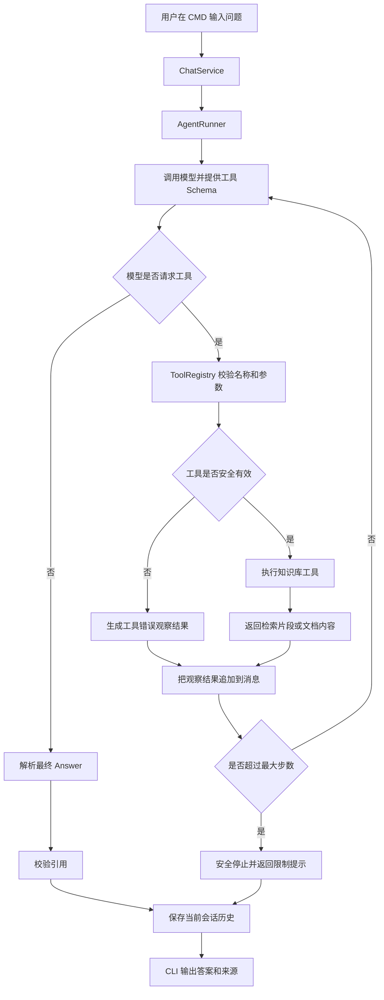

# StudyMate 架构设计

## 1. 设计目标

- 先实现简单、可验证的固定 Workflow。
- 保留后续接入 Tool Calling、Memory 和 Agent Loop 的扩展点。
- 将模型、检索、存储和 CLI 隔离，方便测试和替换。

## 2. 分层结构

~~~text
Interface
  cli.py
    |
Application
  ingest_service.py
  chat_service.py
  evaluation_service.py
    |
Domain
  models.py
  ports.py
  policies.py
    |
Adapters
  filesystem_loader.py
  sqlite_index.py
  llm_client.py
  session_store.py
~~~

## 3. 运行时流程

~~~text
用户输入
  -> Command Parser
  -> Intent Router
  -> Session Store
  -> Search Index
  -> Context Builder
  -> LLM Client
  -> Answer Validator
  -> Citation Validator
  -> CLI Renderer
~~~

## 4. 第一版固定 Workflow

~~~text
handle_input
  -> parse command
  -> classify intent
  -> retrieve top-k chunks
  -> build prompt
  -> call LLM
  -> validate answer
  -> save session message
  -> render result
~~~

## 5. 第一阶段 Agent Runtime

当前 Application 层已经增加最小 Agent Runtime：

~~~text
AgentRunner
  -> send messages and tool schemas to LLM
  -> receive final answer or tool calls
  -> validate tool name and arguments
  -> execute registered tool
  -> append tool result as observation
  -> repeat until final answer or max steps
~~~

`AgentRunner` 不执行任意代码。所有模型可见能力必须先注册到 `ToolRegistry`，第一阶段只注册 `search_knowledge` 和 `open_document`。

Domain 层不应直接依赖具体模型 SDK、CLI 框架或向量数据库。

## 6. 边界

- Knowledge Loader 只负责读取和切分。
- Search Index 只负责检索。
- LLM Client 只负责模型请求和响应解析。
- Chat Service 负责业务流程。
- CLI 只负责输入和展示。

## 7. 运行流程图

